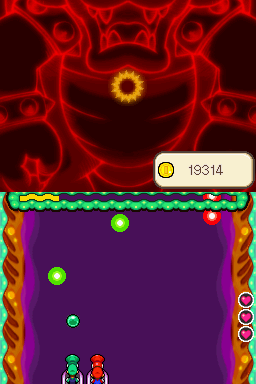

# Mario & Luigi mini-game in JavaScript

🎮 **Play Online:** [Click here to play](https://GabrielAntoine.github.io/javascript-game-mario-and-luigi/)

This repository contains the source code for the recreation of the mini-game *Boats of Revival* from *Mario & Luigi: Bowser's Inside Story* originally released on *Nintendo DS* in 2009. The game was developed using only vanilla js, and plain HTML/CSS. In other words: it does not contain any fancy features like *Node.js*, *TypeScript* or any random library. To develop the game, I was asked to use the HTML5 Canvas API which gives you a full 2D rendering engine inside your browser. 

## Context

I made this game as part of the course titled "*UE : DEV. APP. : Programmation web avancée*" of *Haute École de la Province de Liège*. The game was meant to be included in a larger arcade-like website alongside four other students' games. That website is no longer available and I do not own its repository.

## What is it about?

Just run the game, you'll find the rules inside it. It's in French ? Yeah, just use a translation tool.

The game itself is an arcade game where you must make the biggest score possible before you'll eventually lose.

## What did I learn doing that?

I learned a lot while doing this project. Here are the things I consider the most important:

- JavaScript itself. This was my first exposure to the language as I've never used it before.
- How to animate a game: using the `requestAnimationFrame` function to draw each frame to update the elements' position so that they appear to be moving.
  - Additionally, alternating between shape-rendering (rectangles and circles) and sprite-rendering (actual images)
- How to handle hitboxes between different kinds of objects (rectangle/circle, circle/circle).
- How to move characters according to user inputs.
- How to make maintainable code by keeping it well organized. I still find the code pretty easy to read!
- How to generate new items on screen at runtime and properly clean the memory afterwards.
- A bit of SCSS. While it's not very important, I took the opportunity to use it instead of plain CSS.

And the hardest of them all (which I am the proudest of): handling complex motions for an object. The shells/bats (called `EnergyBalls` in the code according to the original game) have complex motions :
  - Knot pattern (called `NodePattern` in the code, sorry for the English confusion): the shells move in a straight line but make a loop at some point.
  - Stairs pattern: the shells seem to go down a staircase.
  - Sine pattern: the bats move according to a sine curve and randomly change directions.
  - and more
To do so, I came to the idea that the complex motions should be decomposed into simple motions (linear, circular, etc.). For example, the knot pattern is just a linear motion, a circle motion and a final linear motion. This allowed me to generate as many patterns as I wanted very easily ! (and more could be added with little to no difficulty)

While this is not the biggest and hardest project I've made, this is still (as of December 18, 2025) the one that I've enjoyed the most while working on!

## Installation

Since this is a fully static project, just clone the repository and run the [HTML page](index.html) on your beloved browser.

⚠️ If you have CORS errors, open the [HTML page](index.html) on a local static server. I recommend using the [***Live Preview***](https://marketplace.visualstudio.com/items?itemName=ms-vscode.live-server) extension of VSCode.

## Apologies

There is no documentation nor a lot of comments because this was just a school project which I did not intend to make public back then. Since I'm too lazy to write them now, they'll never make it to existence. Sorry!

## Original Game

[Click here to access the description of the original game](https://www.mariowiki.com/Rump_Command)

## Intellectual Property

This project is fanmade. All characters, names, and assets from *Mario & Luigi* are
trademarks of Nintendo and are not owned by me. The MIT License applies only to the
source code written by the author.
